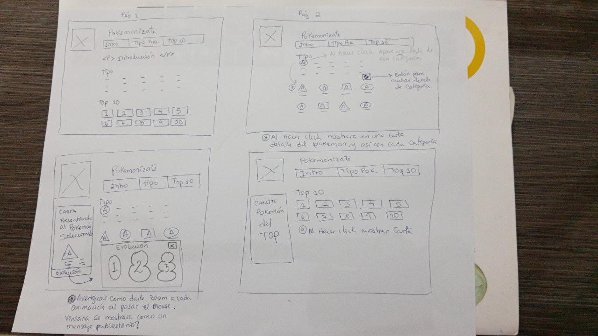
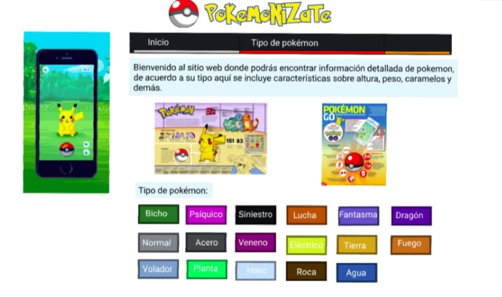

# Data Lovers

## Índice

* [1. Preámbulo](#1-preámbulo)
* [2. Resumen del proyecto](#2-resumen-del-proyecto)
* [3.Historias de usuario](#3-Historias-de-usuario)
* [4. Diseño de Interfaz](#4-Diseño-de-Interfaz)
* [5. Herramientas](#5-Herramientas)
* [5. Deploy](#5-HDeploy)
***

## 1. Preámbulo

"Pokemonizate" es una página que contiene todas las características e información necesaria para usar en Pokémon GO de los 151 primeros pokemones de la región de Kanto. Puedes encontrar a los personajes mediante filtros (ordenar por número de pokedex, órden alfabético) o por categorías (agua, fuego, hielo, dragón, planta, veneno, etc). Es una web intuitiva y fácil de manejar. Sin necesidad de seguir instrucciones el usuario puede acceder a toda la información que contiene.

## 2. Resumen del proyecto

En el proyecto “Data lovers” elegimos como tema Pokémon Go, con el objetivo de contribuir el uso del juego, pensando crear una galería digital que pueda mostrar información sobre los pokémones de tal modo administrarlos y así poder ayudar con una búsqueda mas efectiva, entre otras funciones. Pero para lograr este proyecto y tener claras nuestras funciones, decidimos empezar definiendo nuestros USUARIOS mediante entrevistas y buscar una necesidad que ellos tengan al respecto. ENTREVISTAS Formulamos las siguientes preguntas:

¿Por qué te gusta jugar Pokémon Go?
¿Sientes que alguna librería te brinda información necesaria de los Pokemones?
¿En qué te basas tu para escoger un pokémon?
¿Cómo te gustaría ordenar tu librería de pokemones?

## 3. Historias de usuario

Historia 1

COMO: Jugador de Pokémon Go.

QUIERO: Filtrar los pokémon según el tipo.

PARA: Poder agrupar los pokémones según su tipo.

CRITERIOS DE ACEPTACIÓN

La página debe permitir filtrar según el tipo.

El usuario debe poder seleccionar el tipo de cada pokemon.

Debe pasar Test unitario.

Debe ser responsive.

Historia 2

COMO: Jugador de Pokémon Go.

QUIERO: Poder ordenar los pokemones alfabeticamente, y por su número.

PARA: poder tener un orden especifico a la hora de la busqueda.

CRITERIOS DE ACEPTACIÓN

La página debe permitir ordenar de A-Z.

La página debe permitir ordenar de 001-151.

El usuario debe poder seleccionar el orden que desee obtener.

Debe pasar Test unitario.

Debe ser responsive.

### 4. Diseño de Interfaz

Las preguntas estaban enfocadas a la funcionalidad, necesidad y expereciencia del usuario y el prototipo una idea en proceso de cambios. De esta forma obtuvimos nuestras historias de usuario definidas, para poder realizar nuestro maquetado en figma.

PROTOTIPO DE BAJA FIDELIDAD

Nuestras primeras maquetas la trabajamos en baja fidelidad, teniendo en cuenta las historias de USUARIO. Nuestra primera historia, es “filtrado por tipos pokemones” de esta forma continuamos trabajando con nuestra segunda historia que se basaba en “ordenar alfabeticamente y por su número”.

PROTOTIPO DE ALTA FIDELIDAD

Para continuar con nuestro Proyecto, mostramos nuestro trabajo a nuestras compañeras, y con nuestro Squad, en donde obtuvimos muchos feedback de fuentes de letra, posiciones, imágenes, en pocas palabras estilos, de esa forma obtuvimos nuestra segunda maqueta, y pasamos a realizar el Figma, gracias a cada feedback logramos obtener una mejor versión.

\* Puedes ver el detalle de la versión Destock en este [link](https://www.figma.com/proto/cgwb5iWQQ7rKM7I9npgWvv/Untitled?node-id=1%3A2&scaling=scale-down).

La versión Tablet en este [link](https://www.figma.com/proto/cgwb5iWQQ7rKM7I9npgWvv/Untitled?node-id=23%3A2&scaling=scale-down).

La versión Phone en este [link](https://www.figma.com/proto/cgwb5iWQQ7rKM7I9npgWvv/Untitled?node-id=87%3A37&scaling=scale-down).

#### 5. Herramientas

* [Git](https://git-scm.com/)
* [GitHub](https://github.com/)
* [GitHub Pages](https://pages.github.com/)
* [Node.js](https://nodejs.org/)
* [Jest](https://jestjs.io/)
* HTML y CSS.

#### Deploy

***
